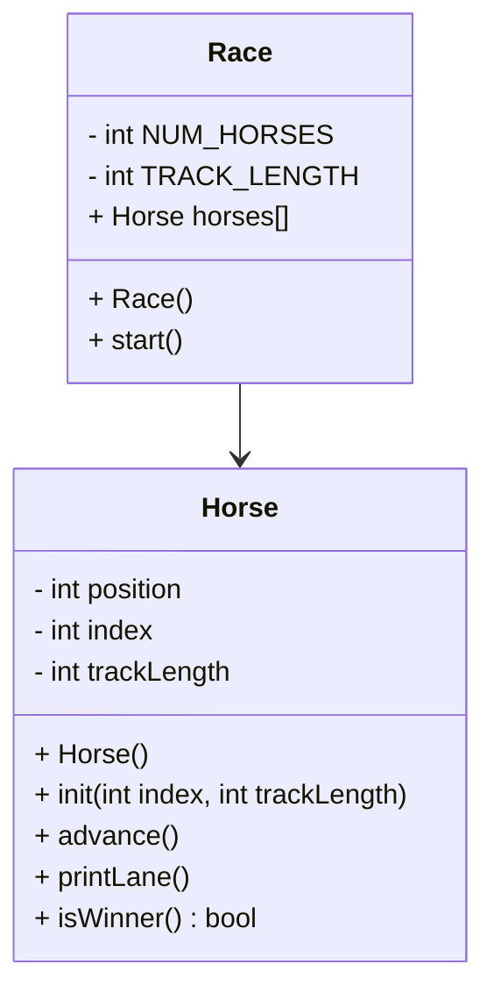

# HORSE RACE
## UML:



## Race::Race()
```
const int TRACK_LENGTH
const static int NUM_HORSES

Create an array of horses length NUM_HORSES
Initialize all the horses
for each horse
  initialize that horse with its index and the track length // init(int index, int trackLength)
```

## Horse::start()
```
seed randomNumGenerator
bool keepGoing
while keepGoing:
  go through each horse:
    advance that horse
    print that horse's lane
    if that horse won:
      set keepGoing to false
```

## Horse::Horse()
```
position = 0 
index = 0
trackLength = 15
```

## void Horse::init(int index, int trackLength)
```
Horse::index = index
Horse::trackLength = trackLength
Horse::position = 0
```

## void Horse::advance()
```
roll random num generator 0-1 int, put in coin
add coin to position -> position
if coin = 0:
  advance horse 1 position
  else:
    no change
```

## void Horse::printLane()
```
for pos = 0 to tracklength:
  if Horse::position == pos:
    print Horse::index
  otherwise
    print '.'
print a newline at the end
```

## bool Horse::isWinner()
```
bool winning = false
if position >= trackLength
  winning = true
  print a winning message
return winning
```

work on Make Files on Friday


